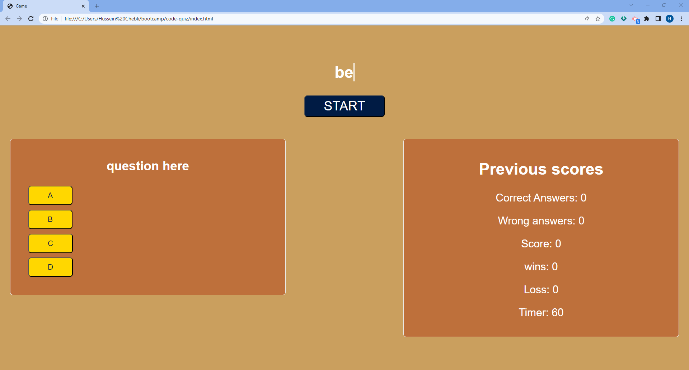
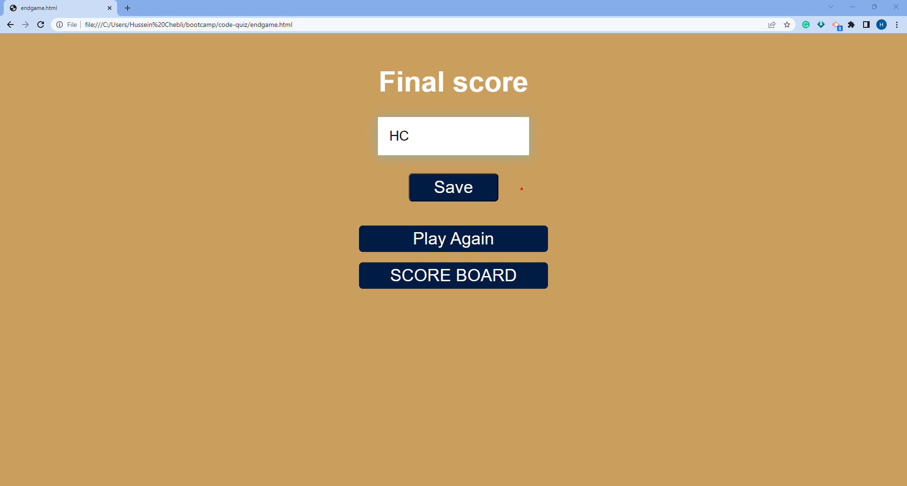
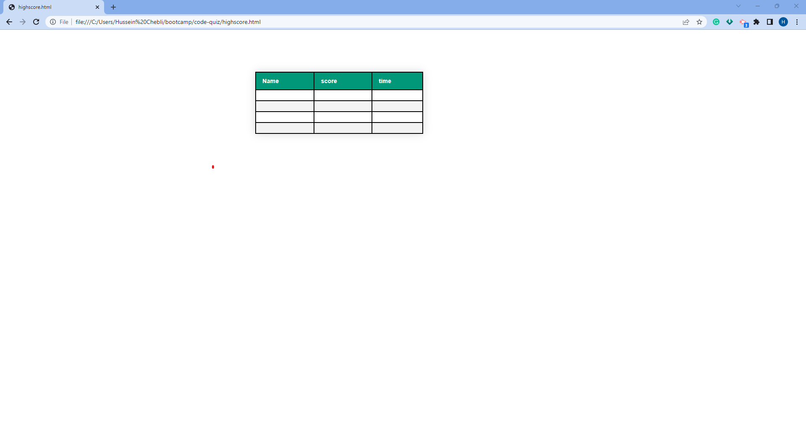

# 04 Web APIs: Code Quiz

## User Story

```
AS A coding boot camp student
I WANT to take a timed quiz on JavaScript fundamentals that stores high scores
SO THAT I can gauge my progress compared to my peers
```

## Acceptance Criteria

```
GIVEN I am taking a code quiz
When I open the page, a styled message will appear and give quiz instructions
WHEN I click the start button
THEN a timer starts and I am presented with a question
WHEN I answer a question
THEN I am presented with another question
WHEN I answer a question incorrectly
THEN time is subtracted from the clock
WHEN all questions are answered or the timer reaches 0
THEN the game is over
WHEN the game is over
THEN I can save my initials and my score
```

## Struggles

```
I struggled with the localstorage. I had a problem using the getItem and setItem functions to get the highscores and current scores and use them in other pages.
```
## Resources
* https://css-tricks.com/snippets/css/typewriter-effect/
* https://www.youtube.com/watch?v=DFhmNLKwwGw

## Notes

```
I added comments to every major line of code to keep it clear and understandable
Researched concepts online using different sources such as MDN 
I
```

## Screenshot Demonstration
in this case the user chose only special characters and uppercase letters with a password length of 48 





## Deployed link
```
please find the deployed link below:
```
* https://hkchebli.github.io/code-quiz